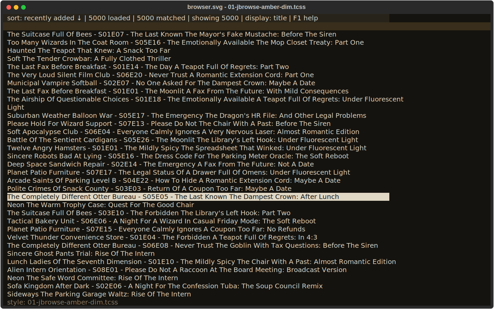
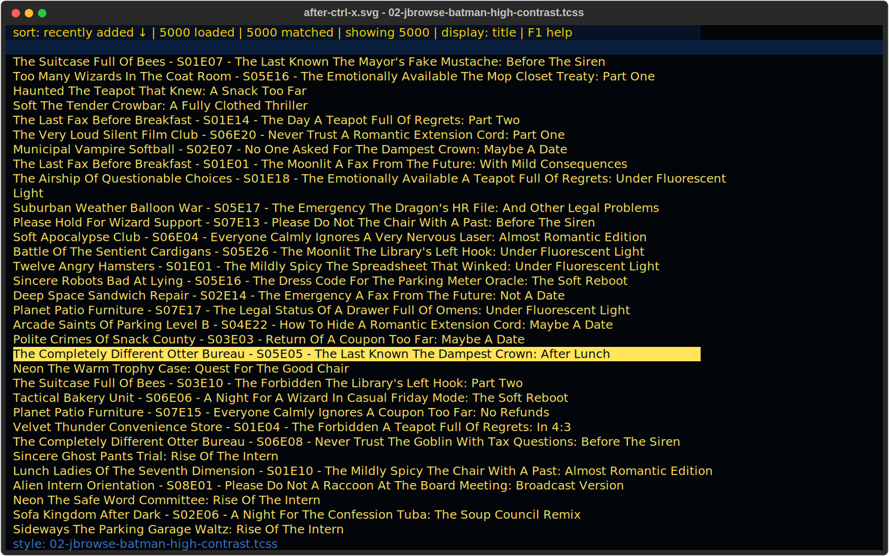
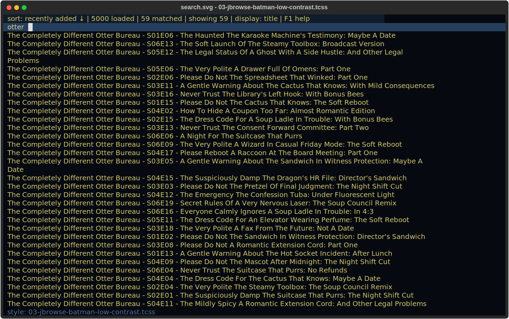
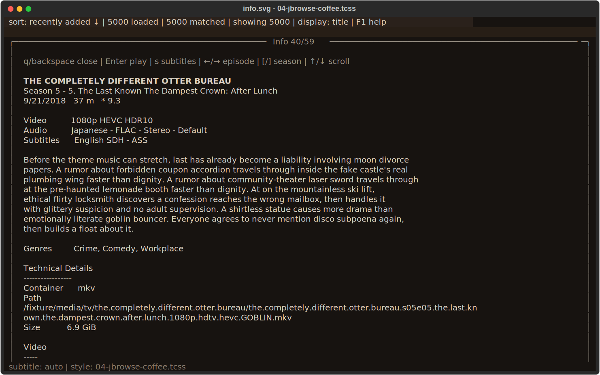
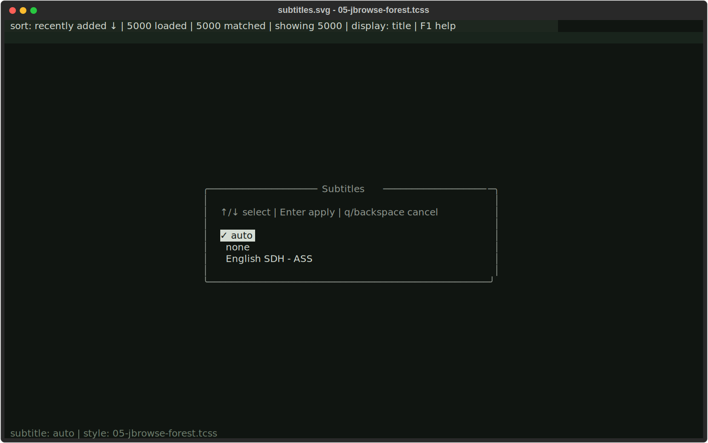
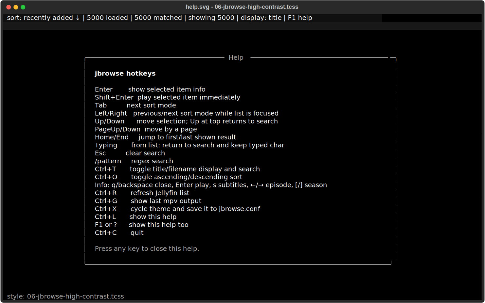
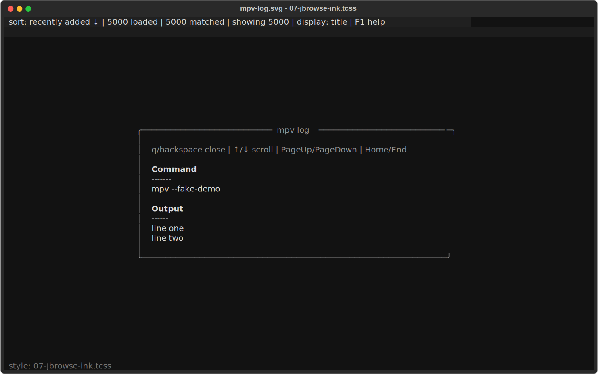
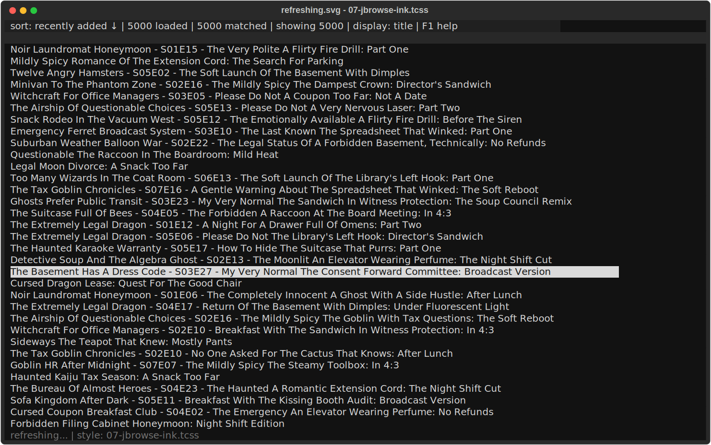

# jbrowse

`jbrowse` is a tiny terminal UI Jellyfin browser and `mpv` launcher.

It lets you log into Jellyfin, browse/search your media locally, open an info page, and launch playback in `mpv`.

Current prototype version:

```text
0.0.34
```

Current main script:

```text
jbrowse.py
```

## Status

This is an actively evolving prototype. It is usable, but not yet packaged.

Current features:

- Jellyfin login.
- Local browsing/search after item load.
- Fast list rendering using a single Textual `Static` widget.
- Title/filename display modes.
- Regex search using `/pattern`.
- Info page with Jellyfin-style media details.
- Jellyfin resume progress on the info page.
- Episode navigation from info page.
- Subtitle picker from the info page.
- Background `mpv` playback while `jbrowse` stays open.
- **mpv IPC** for accurate playback control and position reporting.
- **Accurate Jellyfin playback reporting** via IPC (start, periodic progress, stopped).
- **Now Playing page** (Ctrl+N) with live progress bar, track info, pause state.
- **Playback control menu** (Ctrl+P) — global overlay for pause, seek, quality, stop.
- **Pause/seek controls** — Space toggles pause, `,`/`. seek ±10s.
- **Replace playback prompt** — confirmation overlay when playing over active playback.
- **Static bitrate selection** (Ctrl+B) — cycle quality presets via transcoding.
- Configurable `mpv_cmd` playback template.
- `mpv` command/output viewer with `Ctrl+G`.
- Resume start position from Jellyfin user data.
- Sort modes: recently added, last played, premiere date, name, series order.
- Sort mode and sort direction persistence.
- Theme cycling.
- Simple item cache for faster startup.
- Background Jellyfin refresh after cached startup.
- Non-blocking manual refresh with `Ctrl+R`.
- Periodic background refresh while recently active.
- Background refresh after playback returns.
- Example config and gitignore.
- Theme files under `themes/`, including Batman low/high contrast themes.

Not implemented yet:

- Audio picker.
- Better help text / key map cleanup.
- Split into modules.
- Build files / Arch packaging.
- Windows portability.

## Screenshots

These screenshots use the committed fictional fixture library, not a real Jellyfin server or media collection.

See [THEMES.md](THEMES.md) for the complete named-theme gallery.

### Browser

The main library view with the selected item highlighted.



### Theme Cycle

The browser after a `Ctrl+X` theme cycle.



### Search

Typing `otter` filters the fixture library and shows the current match count.



### Item Information

Episode details, stream metadata, and the current subtitle choice.



### Subtitle Picker

The per-item subtitle selector opened from the information panel.



### Help

The in-app keyboard reference.



### mpv Log

The captured mpv command and output view.



### Refresh State

The browser while a background refresh is in progress.



## Requirements

Python dependencies:

```bash
pip install textual requests
```

System dependency:

```bash
mpv
```

On Arch/CachyOS:

```bash
sudo pacman -S mpv python-requests python-textual
```

## Quick start

Put the script somewhere convenient:

```bash
chmod +x jbrowse.py
./jbrowse.py
```

Create a config file named:

```text
jbrowse.conf
```

Either next to the script or at:

```text
~/.config/jbrowse/jbrowse.conf
```

Example:

```ini
[jellyfin]
url = http://127.0.0.1:8096
username = your-login
password = your-password

[library]
types = Movie,Episode,Video,MusicVideo

[ui]
sort_mode = added
sort_desc = true
max_display_items = 0
display_mode = title

[style]
# path = themes/03-jbrowse-batman-low-contrast.tcss

[mpv]
# mpv_cmd = mpv --hwdec=auto --force-media-title="$filename" $subtitle $start "$url"

[cache]
refresh_interval_minutes = 10

[playback]
quality_presets = direct,40mbps,20mbps,12mbps,8mbps,4mbps,2mbps
default_quality = direct
```

## Controls

### Browser

```text
Enter        show selected item info
Shift+Enter  play selected item immediately
Tab          next sort mode
Left/Right   previous/next sort mode while list is focused
Ctrl+O       toggle ascending/descending sort
Ctrl+T       toggle title/filename display and search
Up/Down      move selection; Up at top returns to search
PageUp/Down  move by a page
Home/End     jump to first/last shown result
Typing       from list: return to search and keep typed char
Esc          clear search
/pattern     regex search
Ctrl+R       refresh Jellyfin list in the background
Ctrl+G       show mpv output
Ctrl+K       stop active mpv playback
Ctrl+P       playback control menu
Ctrl+B       cycle quality / bitrate
Ctrl+N       now playing page
Ctrl+X       cycle theme and save it to jbrowse.conf
Ctrl+L       show help
F1 or ?      show help
Ctrl+C       quit (stops active mpv first)
```

### Playback controls (when playing)

```text
Space        pause/play toggle
, / .        seek -10s / +10s
```

### Playback control menu (Ctrl+P)

```text
Space        pause/play toggle
, / .        seek -10s / +10s
Ctrl+B       cycle quality
Ctrl+K       stop playback
Ctrl+N       now playing page
w            show Jellyfin web URL
q/esc/back   close menu
```

### Info page

```text
q/backspace  close info
Enter        play shown item
s            open subtitle picker
w            show Jellyfin web URL for this item
Ctrl+R       refresh Jellyfin list in the background
←/→          previous/next episode
[/]          previous/next season
↑/↓          scroll
PgUp/PgDn    scroll by page
Home/End     top/bottom
```

### Subtitle picker

```text
↑/↓          select subtitle mode/track
Enter        apply
q/backspace  cancel
```

### Now Playing page

Auto-opens when playback starts. Truncated title shown in bottom bar (e.g. `Rick and Morty - S09E02`).

```text
q/backspace  return to browser
Space        pause/play toggle
, / .        seek -10s / +10s
s            open subtitle picker
w            show Jellyfin web URL for this item
Ctrl+G       show mpv log
```

## Config lookup

`jbrowse` looks for config in this order:

1. `jbrowse.conf` next to the script.
2. `~/.config/jbrowse/jbrowse.conf`.

If no config exists, it prints an example and exits.

## State file

`jbrowse` stores its Jellyfin device id in:

```text
jbrowse.state
```

Lookup order:

1. `jbrowse.state` next to the script, if it exists.
2. `~/.cache/jbrowse/jbrowse.state`.

## Item cache

`jbrowse` stores a simple item cache in:

```text
jbrowse.items.json
```

The app opens from cache first, then refreshes in the background.

## mpv command config

`jbrowse` launches playback with this built-in command template:

```text
mpv --hwdec=auto --force-media-title="$filename" $subtitle $start "$url"
```

You can override it in `jbrowse.conf`. Supported placeholders: `$url`, `$filename`, `$title`, `$subtitle`, `$start`.

## Quality presets

The `[playback]` config section controls quality cycling with `Ctrl+B`:

```ini
[playback]
quality_presets = direct,40mbps,20mbps,12mbps,8mbps,4mbps,2mbps
default_quality = direct
```

`direct` uses the original Jellyfin stream URL. Other presets use Jellyfin transcoding with `MaxStreamingBitrate`. Quality changes mid-playback use IPC `loadfile_replace` to maintain position.

## Server writes

The only intentional server mutations are the registered playback session reports: start, progress, and stopped. Each playback writes a timestamped `~/.cache/jbrowse/mpv.out-YYYYMMDD-HHMMSS-ffffff` log file. These can contain stream credentials; do not share them.

## Development notes

Experimental fixture UI screenshots:

```bash
python tools/svg_screenshot_poc.py
```

Run IPC smoke test against real Jellyfin:

```bash
python tools/svg_screenshot_poc.py --ipc-only --real
```

Browse fixture data interactively without contacting Jellyfin:

```bash
./jbrowse.py --fake
```
